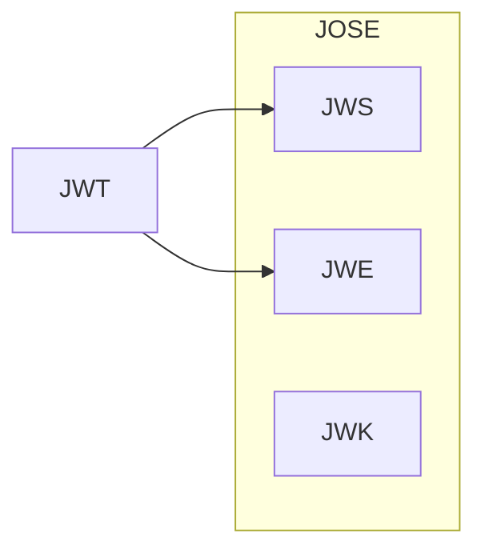

# memo

- [memo](#memo)
  - [create key](#create-key)
    - [RSA](#rsa)
    - [EC](#ec)
  - [JWT vs JWK vs JWS vs JWE vs Jose](#jwt-vs-jwk-vs-jws-vs-jwe-vs-jose)

## create key

- [memo](#memo)
  - [create key](#create-key)
    - [RSA](#rsa)
    - [EC](#ec)
  - [JWT vs JWK vs JWS vs JWE vs Jose](#jwt-vs-jwk-vs-jws-vs-jwe-vs-jose)

### RSA

```bash
openssl genrsa -out private.key.rsa.pem 4096
openssl rsa -in key.pem -pubout -out public.key.rsa.pem
```

### EC

```bash
openssl ecparam -list_curves
openssl ecparam -name prime256v1 -genkey -noout -out key.pem
openssl ec -in key.pem -pubout -out pubkey.pem
```

## JWT vs JWK vs JWS vs JWE vs Jose


